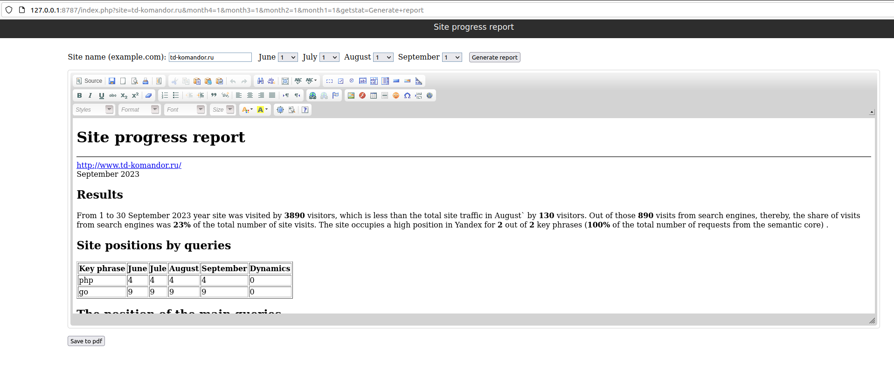
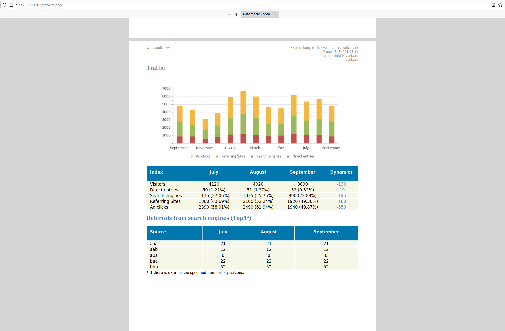

# Reviving the dead

My very first commercial application developed in late 2011. It used to run on PHP 5.3 at that time but after some adjustments I managed to make it running on PHP 7.1. A perfect example of how not to write code.

## Requirements

* php 7.1
* xml
* gd
* curl
* xdebug
* mbstring

## How to run

1. Make sure to install php 7.1 and all required extensions:

```bash
sudo apt install php7.1-cli php7.1-dom php7.1-xdebug php7.1-gd php7.1-curl php7.1-mbstring
```

2. Install Docker to run wiremock (the APIs this app is using are dead and I had to mock them)
3. Add these two hosts to `/etc/hosts`:
```
127.0.0.1	api-metrika.yandex.local
127.0.0.1	www.seolib.local
```
4. Run `./wiremock.sh`
5. You'll see a link, i.e. `Listening on http://127.0.0.1:8787` - click on it
6. Login with avanta/avantapass
7. Fill `td-komandor.ru` for the site name and choose 1/1/1/1 for days (it's the ones that are mocked)
8. Click "Generate report"

## How I made it running on PHP 7.1

1. Made compatible with PHP 7.1
    * class name => `__construct`
    * remove PHP version check in jpgraph library
    * initialize array elements before accessing them
   ```php
   $top3count[$i] = $top3count[$i] ?? 0; // <== initialize
   $top3count[$i]++;
   ```
    * `mb_convert_encoding` does not accept arrays anymore
    * `preg_replace` => `preg_replace_callback` (the former does not support `e` modifier)
    * `mpdf` - `intval($size)` for `1px` and similar because auto convert does not work anymore
2. Re-formatted the code & replaced occasional tabs with spaces
3. Wiremock stubs - this is the one that took 99% of the time

## How it looks like

Beautiful isn't it? 😁


